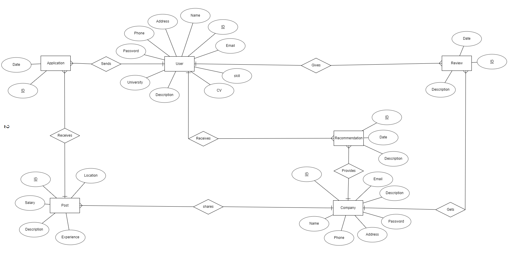

# JOB_FINDER

A website where the companies will be able to post about their available job openings and the job finders will be able to apply for the jobs. The project details can be found [here](https://github.com/Nawrin14/JOB_FINDER/blob/master/Job%20Finder.pdf).

# Description

Finding a job has never been an easy task. It needs patience to search for a suitable job opening and to apply for them. People also might lose an opportunity due to missing relevant information. The aim of this project is to resolve these issues by providing a platform for the people who are looking for jobs. Through the website, the companies will be able to post about their available job openings and the job finders will be able to apply for the jobs. The purpose of this website is to make the job finding process easier and to ensure that no suitable candidate misses a good job opportunity.

# Features

1. Any company or a person can create an account and update their information.
2. Any company can post about a job opening.
3. The users can apply for a job in the given post.
4. The users can find posts according to the location, experience and salary mentioned on those posts.
5. The company can see all of their posts from their profile and the persons who applied. The company can also see the profile of the persons who applied.
6. The company can write a recommendation for anyone as well as see other recommendations from that person’s profile.
7. The company can also see and download the CV of any person.
8. Any person can write a review about any company as well as see other reviews from that company’s profile.

# Entity-Relationship Diagram

# Other Contributors

1. [Monjure Mowla Abir](https://github.com/abir2727) 
2. [Kaji Fuad Bin Akhter](https://github.com/FuadBinAkhter)
